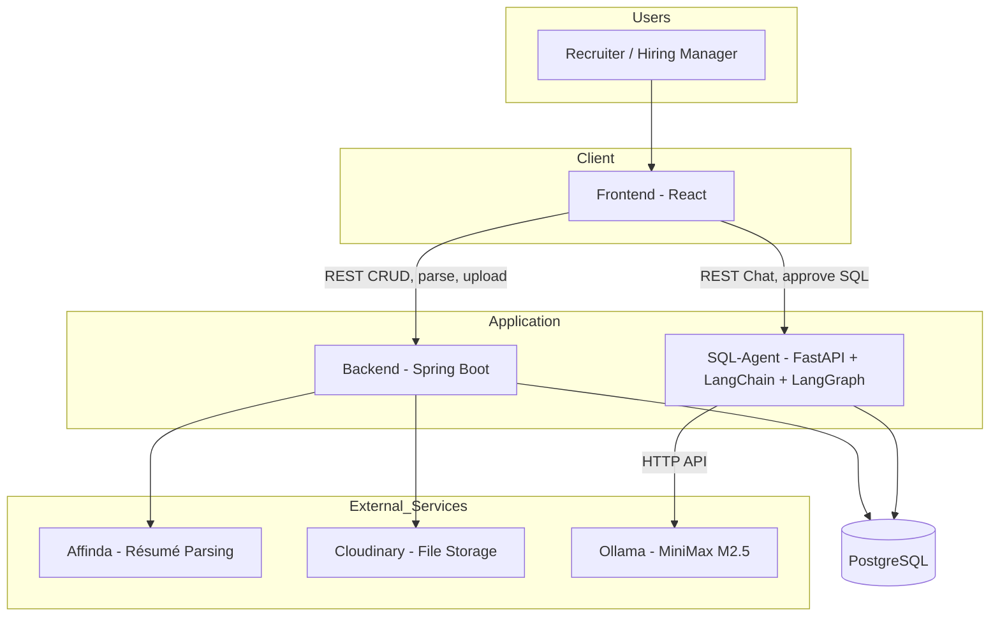
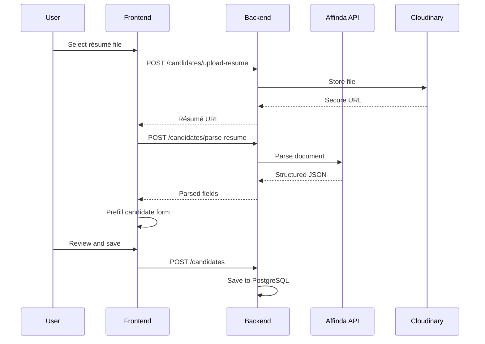
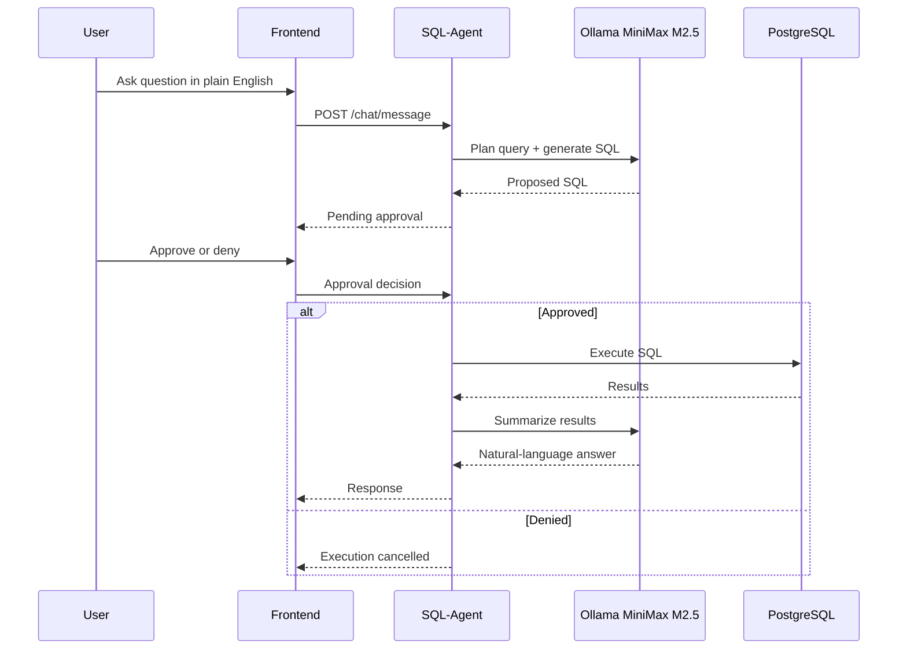
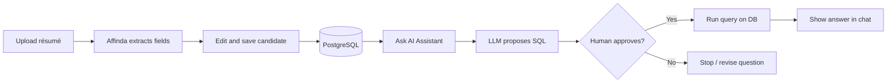

# Jolyne — Application Overview

---

## 1. Introduction

**Jolyne** is an AI-powered HR and recruiting platform built to help hiring teams work faster and smarter. It brings together candidate management, automated résumé intake, and a safe natural-language analytics assistant in one place.

Recruiters can:

- **Manage candidates** — create profiles, track pipeline stages, search by skills, and maintain a single source of truth in PostgreSQL.
- **Speed up onboarding** — upload a résumé (PDF/DOCX) and automatically extract name, contact details, skills, work experience, education, and more into editable forms.
- **Ask questions about the talent pool** — use an in-app **AI Assistant** to type everyday questions (e.g. *“How many candidates applied this month?”*). The system proposes SQL against the recruiting database and can **pause for human approval** before running sensitive queries.

The system is split into three main parts that work together:

| Component | Role |
|-----------|------|
| **Frontend (React)** | User interface for dashboards, candidates, jobs, and the AI chat |
| **Backend (Spring Boot)** | Business APIs, database persistence, file uploads, résumé parsing |
| **SQL-Agent (Python)** | Analytics chatbot connected to the same database and an LLM |

---

## 2. Technical Stack

### Backend (Spring Boot / Java)

| Technology | Purpose |
|------------|---------|
| **Java 17** | Core language |
| **Spring Boot 3.2** | REST APIs, dependency injection, configuration |
| **Spring Data JPA** | Persistence layer |
| **PostgreSQL** | Primary database (e.g. Neon in cloud) |
| **Cloudinary** | Résumé file storage (`/candidates/upload-resume`) |
| **Affinda** | Résumé parsing API — Backend forwards uploaded files to Affinda and returns structured JSON (name, skills, experience, education, etc.) to the UI |
| **Jackson** | JSON serialization for APIs and parsed résumé data |
| **Lombok** | Boilerplate reduction |

Typical port: `http://localhost:8080`

### Frontend (React)

| Technology | Purpose |
|------------|---------|
| **React 19** | UI framework |
| **React Router** | Navigation between pages |
| **Fetch API** | Calls to Backend (`REACT_APP_API_BASE_URL`) and SQL-Agent (`REACT_APP_CHAT_API_BASE_URL`) |
| **Recharts** | Dashboard charts |
| **Lucide React** | Icons |
| **React Markdown** | AI Assistant message rendering |

Typical port: `http://localhost:3000`

Key flows:

- Candidate CRUD, search, pipeline updates → **Backend**
- Résumé upload + parse → **Backend** (`/candidates/upload-resume`, `/candidates/parse-resume`)
- AI Assistant chat → **SQL-Agent** (`/chat/start`, `/chat/message`, approval endpoints)

### SQL-Agent (Python)

| Technology | Purpose |
|------------|---------|
| **Python 3.12** | Runtime |
| **FastAPI** | HTTP API for chat sessions and tool approval |
| **LangChain** | LLM integration, prompts, SQL tools |
| **LangGraph** | Agent workflow (ReAct pattern, human-in-the-loop before SQL execution) |
| **SQLAlchemy / psycopg2** | PostgreSQL access (same DB as Backend) |
| **Uvicorn** | ASGI server |

Typical port: `http://localhost:8000`

The SQL-Agent exposes tools such as listing tables, describing schema, checking SQL, and running approved queries against the recruiting dataset.

### LLM — Ollama (MiniMax M2.5)

| Setting | Typical value |
|---------|----------------|
| **Gateway** | [Ollama](https://ollama.com) — local LLM server (`http://127.0.0.1:11434`) |
| **Model** | `minimax-m2.5:cloud` (configured via `OLLAMA_MODEL`) |
| **Provider flag** | `MODEL_PROVIDER=ollama` |

Ollama acts as the bridge between the SQL-Agent and the language model. The agent uses the model to understand natural-language questions, plan SQL, and format answers — while **human approval** controls when SQL actually runs.

Alternative providers (Groq, Gemini) can be configured in `SQL-Agent/.env` for development or demos.

---

## 3. Architecture Diagram

High-level system view:

---

## 4. Flow Diagrams

### 4.1 Résumé upload and parsing (Affinda)

### 4.2 AI Assistant — natural language to SQL (with approval)

### 4.3 End-to-end “day in the life”

---

## 5. Solution Provided

Jolyne addresses common recruiting pain points with an integrated solution:

| Problem | How Jolyne solves it |
|---------|----------------------|
| Manual data entry from résumés | Affinda-powered parsing pre-fills candidate forms from PDF/DOCX |
| Scattered candidate information | Central PostgreSQL database with structured and JSON fields |
| Need for hiring analytics without SQL skills | SQL-Agent converts questions to SQL with **human-in-the-loop** safety |
| Risk of unchecked AI database access | Approval step before executing generated SQL |
| File handling | Cloudinary stores résumé files; URLs linked to candidate profiles |
| Pipeline visibility | Stages (Applied, Screening, Interview, etc.) and dashboard metrics |

**Deliverables in this repository:**

- Full-stack candidate and job management UI
- REST Backend with upload, parse, CRUD, search, and pipeline APIs
- Python SQL-Agent service with LangGraph agent and chat API
- Documentation and environment templates for local Windows deployment

---

## 6. Strengths

- **Unified platform** — recruiting data, résumé intake, and analytics in one product surface.
- **Faster candidate onboarding** — structured extraction from résumés reduces typing errors and time-to-profile.
- **Specialized parsing** — Affinda is trained for CV layouts and returns consistent field-level JSON.
- **Safe AI analytics** — SQL is proposed by the LLM but not executed until a user approves it.
- **Flexible LLM deployment** — Ollama with MiniMax M2.5 keeps inference local or gateway-controlled; other providers optional.
- **Shared database** — Backend and SQL-Agent read the same PostgreSQL schema for consistent answers.
- **Modern stack** — widely adopted technologies (Spring Boot, React, FastAPI, LangChain) for maintainability and hiring.

---

## 7. Areas to Improve

| Area | Notes |
|------|--------|
| **Résumé parsing cost & dependency** | Affinda is a paid third-party API; consider fallback or hybrid parsers for cost control and offline use |
| **Parser accuracy on edge cases** | Scanned PDFs, multi-column layouts, and non-English résumés may need extra handling |
| **Filter / search depth** | Advanced candidate filters can be extended (experience range, combined skill queries) |
| **Security & auth** | Production deployments should add authentication, role-based access, and audit logging |
| **SQL-Agent safeguards** | Continue tightening which SQL operations are allowed; expand read-only defaults |
| **Operational monitoring** | Add health checks, metrics, and alerting for Backend, SQL-Agent, and Ollama |
| **Model operations** | Document who installs/updates Ollama models and monitors `minimax-m2.5:cloud` usage |
| **Documentation drift** | Keep ports, API keys, and provider settings aligned across `.env` files and this doc |

---

## 8. Conclusion

Jolyne is a practical recruiting workspace that combines **traditional HR workflows** with **AI where it adds clear value**: Affinda for résumé understanding, and an Ollama-powered SQL assistant for ad-hoc talent-pool questions with human oversight.

The architecture separates concerns cleanly — React for experience, Spring Boot for business logic and parsing integration, Python SQL-Agent for analytics intelligence — while sharing one PostgreSQL database. That design supports demo deployments, hackathon showcases, and a path toward production hardening (security, monitoring, and parser flexibility).

For a visual one-page flow, see **[JOLYNE_COMPLETE_FLOW.html](JOLYNE_COMPLETE_FLOW.html)**. For detailed manager-facing notes, see **[MANAGER_SUMMARY.md](MANAGER_SUMMARY.md)**.

---

*Last updated for internal use. Default ports: Frontend `3000`, Backend `8080`, SQL-Agent `8000`, Ollama `11434`.*
