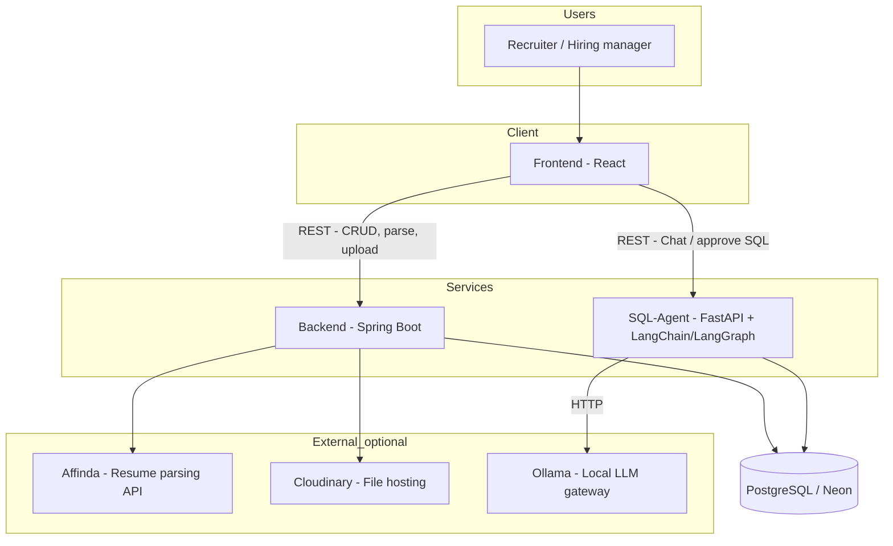
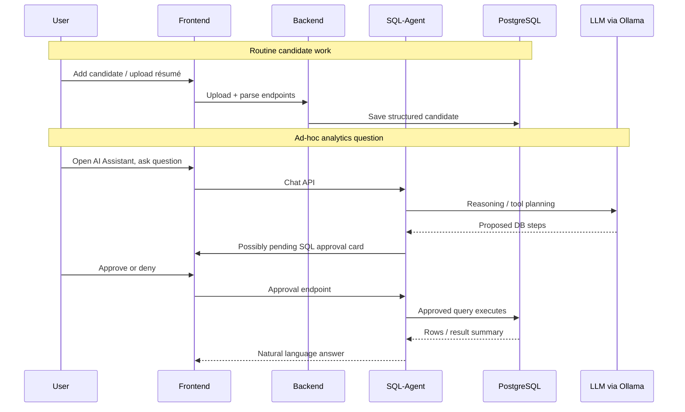
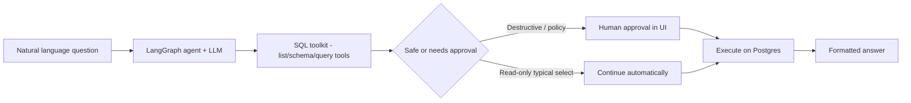
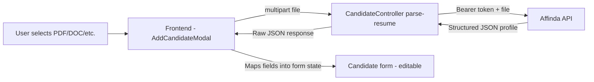
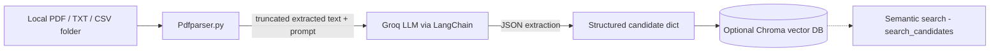

# Jolyne — Summary for Managers

**Audience:** Readers who need a clear picture without deep technical background  
**Purpose:** Explain what the system does, how the pieces fit together, and where AI is used safely.

---

## 1. What is Jolyne (in plain English)?

**Jolyne** is an **HR/recruiting tool** that helps teams:

| Capability | Business value |
|------------|----------------|
| **Manage candidates** | Store profiles, stages, jobs, and history in one place. |
| **Speed up intake** | Upload résumés and **automatically extract** name, skills, jobs, education, etc. into forms instead of typing everything manually. |
| **Ask questions about the talent pool** | A built-in **“AI Assistant”** lets users type questions in everyday language (e.g. “How many engineers applied this month?”). The system **proposes SQL** against the recruiting database but can **pause for human approval** before running anything sensitive. |

Everything lives in three main runtime pieces plus a shared database:

- **Frontend (React)** — what recruiters see and click.
- **Backend (Spring Boot / Java)** — main business APIs, persistence, uploads, and résumé parsing **through Affinda** (commercial parser).
- **SQL-Agent (Python / FastAPI + LangChain / LangGraph)** — the **analytics chatbot** that talks to the **same PostgreSQL database** and to an **LLM** (e.g. **Ollama** with a chosen model).

---

## 2. Plain-English glossary (terms your team may hear)

| Term | Simple meaning |
|------|----------------|
| **LLM (Large Language Model)** | Software that predicts text intelligently — used here to interpret questions, summarize, or extract fields from unstructured text — not magic; it follows prompts and APIs. |
| **Ollama** | An **application you run locally** that serves AI models through a standard URL (often like `http://127.0.0.1:11434`). The team can swap **which model** runs behind it without rewriting the whole app. Example model name users might cite: **`minimax-m2.5:cloud`** — that indicates a **specific model packaged for Ollama** (possibly backed by cloud capacity), still reached through the **local Ollama API**. |
| **LangChain / LangGraph** | **Libraries** used in the SQL-Agent to connect the LLM to **tools** (list tables, read schema, run SQL) under **structured prompts and workflow** (“agent” pattern). **LangGraph** adds control flow — e.g. stop before executing SQL until approval. |
| **SQL-Agent** | A **separate Python service** that exposes a **chat HTTP API**. It converts natural-language questions → proposed database steps → optionally **requests approval** → returns answers. |
| **Affinda** | A **hosted résumé parsing API**. The production UI flow sends the file **to our Backend**, which forwards it **to Affinda** and receives structured JSON. |
| **`Pdfparser.py` (Groq + optional Chroma)** | A **separate experimental/batch utility** under `SQL-Agent/`: reads PDF/text, calls **Groq’s LLM**, can embed results in **Chroma** for semantic search — **not** the same path as Affinda today. Useful for hacks, demos, or offline experimentation. |

---

## 3. How the modules work together

### 3.1 Frontend (React)

- Presents dashboards, candidates, jobs, forms.
- **`REACT_APP_API_BASE_URL`** → talks to Java Backend (e.g. CRUD, parse, uploads).
- **`REACT_APP_CHAT_API_BASE_URL`** → talks directly to **SQL-Agent** for the AI Assistant (chat endpoints such as `/chat/start`, `/chat/message`).
- Typical dev URLs: Frontend `http://localhost:3000`, Backend `http://localhost:8080`, SQL-Agent `http://localhost:8000` (exact ports depend on configuration).

### 3.2 Backend (Spring Boot)

- **Authority** for main business logic: create/update candidates, pipeline stages, file handling.
- **Résumé file storage:** upload to **Cloudinary** (`/candidates/upload-resume`), returns a URL stored with the candidate profile.
- **Résumé text parsing (production path):** `POST /candidates/parse-resume` — Backend securely calls **Affinda** with the API key; returns normalized JSON mapped into the candidate form in the UI.
- **PostgreSQL:** single source of truth for candidates and recruiting data (`NEON_DATABASE_URL` or equivalent connection string configured in Backend + SQL-Agent for that database).

### 3.3 SQL-Agent (Python)

- Loads **environment settings** (provider: Ollama / Groq / Gemini, DB URL, model name).
- On startup builds a **ReAct-style agent**: the model can propose **database tools** (list tables, describe schema, run query, etc.).
- **Human-in-the-loop:** destructive or sensitive SQL routes can pause so the UI shows **approve / deny** before execution **read-heavy** flows may proceed automatically depending on safeguards in code).
- **Does not replace** Backend for candidate CRUD or Affinda parsing — it complements them for **ad-hoc questions** across the dataset.

---

## 4. High-level architecture diagram

End-to-end data flow:

---

## 5. Operational flow diagrams

### 5.1 “Day in the life” — candidate + chat

### 5.2 SQL-Agent internal idea (conceptual)

---

## 6. Résumé parsing — how it works (two distinct paths)

### 6.1 Path A — Production (what the React app uses today)

This is what hiring teams experience in **Add Candidate** / similar screens.

**Steps in plain language:**

1. User picks a résumé file in the UI.
2. Frontend posts it to **`/api/v1/candidates/parse-resume`** (Backend).
3. Backend (`CandidateServiceImpl`) forwards the file to **Affinda**’s hosted parsing service with the **AFFINDA_API_KEY**.
4. Affinda returns a **structured payload** (name, phones, emails, experience blocks, education, skills, etc.).
5. Frontend **maps** that JSON onto form fields — the recruiter **can edit everything** before save.
6. Separately (optional in the workflow), **`/upload-resume`** stores the binary in **Cloudinary** and attaches a **`secure_url`** for later download.

**Why Affinda:** Specialized résumé models and layout handling; avoids maintaining complex PDF parsers in-house for the main product.

### 6.2 Path B — Experimental utility (`SQL-Agent/Pdfparser.py`)

**Not wired into Spring Boot.** Documented here so managers are not confused if developers mention **Groq** or **Chroma** alongside “résumé parsing.”

**What it does:**

1. Extracts raw text (e.g. `pdfplumber` for PDFs).
2. Sends text to **Groq** with a strict “return JSON only” prompt.
3. Optionally **embeds** parsed profiles into **Chroma** for “find similar candidates by meaning” queries.

**When to mention it:** proof-of-concept, batch ingestion, hackathon tooling — **parallel** to the Affinda-backed product flow.

---

## 7. Risks, safeguards, and what to tell stakeholders

| Topic | Talking point |
|--------|----------------|
| **Data access** | SQL-Agent uses the **same database** credentials as analytics; tighten DB roles per environment if needed. |
| **Destructive queries** | The stack is designed around **approval** patterns for risky operations; reinforce **least privilege** on DB accounts for production-like environments. |
| **LLM correctness** | LLMs can hallucinate explanations; **queries** should remain reviewable via the UI approvals and logs. Parsing from Affinda is generally more deterministic than arbitrary free‑text QA. |
| **Third parties** | **Affinda** and **Cloudinary** process data under their respective terms — align with governance if PII crosses borders. |
| **Operational footprint** | **Ollama** runs on-machine (or proxies to cloud-capable models) — clarify who installs/updates models and monitors usage. |

---

## 8. One-paragraph elevator pitch

> Jolyne is a recruiting workspace that saves candidate data to PostgreSQL, accelerates onboarding with Affinda‑powered résumé extraction into editable forms (with Cloudinary for file URLs), and adds an AI-powered SQL assistant backed by LangGraph and a local‑first LLM stack like Ollama — so recruiters can ask natural‑language analytics questions **with safeguards** rather than learning SQL manually.

---

## 9. File map (for follow-up with engineering)

| Area | Representative files |
|------|-------------------------|
| UI → Backend | `Frontend/src/components/AddCandidateModal/AddCandidateModal.js`, `Frontend/src/api/candidateApi.js` |
| Parse + upload APIs | `Backend/.../CandidateController.java`, `CandidateServiceImpl.java` |
| UI → SQL chat | `Frontend/src/components/AIAssistant/AIAssistant.jsx`, `Frontend/src/api/chatbotApi.js` |
| SQL-Agent service | `SQL-Agent/chat_api.py`, `SQL-Agent/langchain_setup.py` |
| Experimental parser | `SQL-Agent/Pdfparser.py` |

---

*Document generated for internal explanation; adjust ports and provider names (`minimax-m2.5:cloud`, etc.) to match your deployed environment.*
